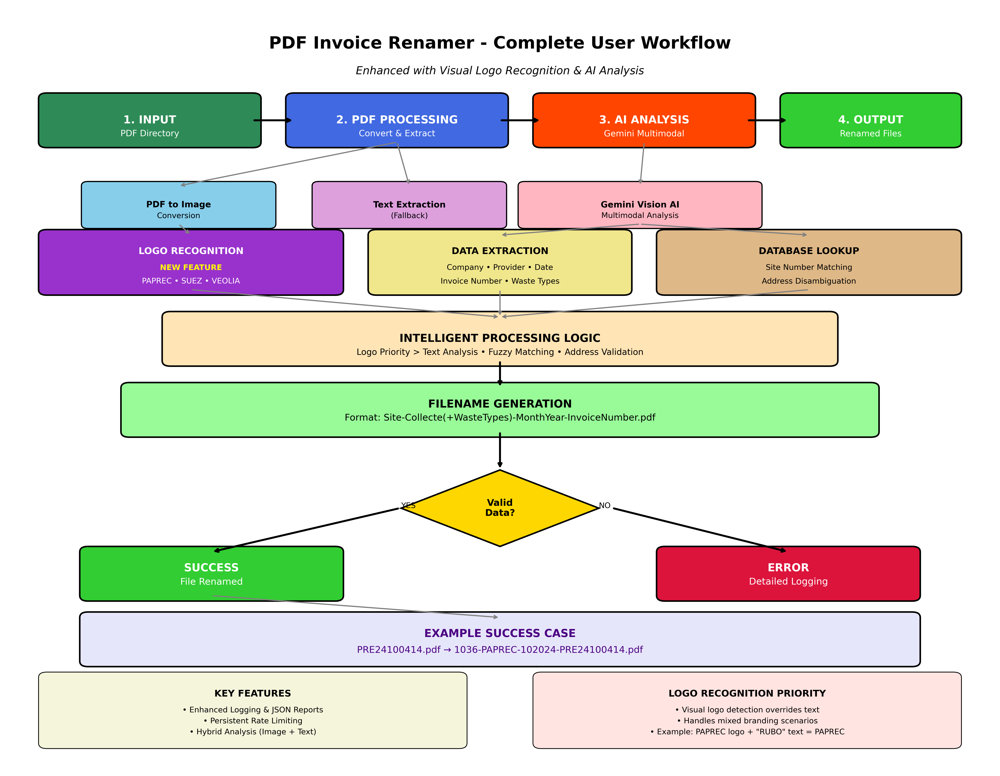

# PDF Invoice Renamer

Automatically renames PDF invoices based on their content using AI analysis and CSV lookup tables.

## Features

- **AI-Powered Content Analysis**: Uses Google Gemini to extract key information from invoice PDFs including restaurant addresses
- **Visual Logo Recognition**: Advanced image-based analysis that identifies company logos (PAPREC, SUEZ, VEOLIA, etc.) when text-based extraction fails
- **Hybrid Analysis System**: Primary image analysis with text extraction fallback for maximum accuracy
- **Excel-Based Restaurant Matching**: Primary data source from `Liste des clients.xlsx` with intelligent address-based disambiguation
- **Address-Aware Matching**: Extracts restaurant addresses from invoices to resolve conflicts when multiple locations share the same name
- **Smart Address Detection**: Automatically handles special cases where company address (SOCIETE RUBO/34 BOULEVARD DES ITALIENS) is shown instead of restaurant address - looks for secondary addresses in such cases
- **Intelligent Restaurant Matching**: Handles various McDonald's name variations (MAC DO, McDonald's, etc.)
- **Waste Type Detection**: Automatically detects DIB, BIO, CS waste types from invoice content
- **CSV-Based Lookup**: Cross-references prestataire data for accurate collecte information
- **Safe Operation**: Includes dry-run mode to preview changes before execution
- **Enhanced Logging System**: 
  - Detailed file-by-file processing logs
  - JSON reports for automated analysis  
  - Clear failure reasons with actionable suggestions
  - See [Enhanced Logging Guide](ENHANCED_LOGGING_GUIDE.md) for details
- **Persistent API Tracking**: Cross-restart usage monitoring with 7-day history

## Naming Convention

Files are renamed using the following format:
```
Site-Collecte(+CS/BIO/DIB)-InvoiceMonthYear-InvoiceNumber.pdf
```

### Example
- Original: `invoice_123.pdf`
- Renamed: `1173-SUEZBIODIBCS-092024-H0E0228333.pdf`

Where:
- `1173` = Site number from Liste des clients.xlsx
- `SUEZBIODIBCS` = Collecte provider + waste types (DIB + BIO + CS)
- `092024` = Invoice month/year (September 2024)
- `H0E0228333` = Invoice number

## Restaurant Matching Algorithm

The system uses a sophisticated multi-step approach for restaurant matching:

1. **Excel-First Approach**: Primary data source is `Liste des clients.xlsx` containing 900+ restaurant locations with addresses and postal codes
2. **Name-Based Matching**: Finds restaurants with similar names using fuzzy matching algorithms
3. **Address Disambiguation**: When multiple restaurants share the same name, uses extracted addresses to find the correct location
4. **Postal Code Fallback**: If name and address matching fails, uses postal code matching as a final fallback method
5. **Similarity Scoring**: Calculates address similarity scores to select the best match
6. **Fallback Protection**: Handles edge cases gracefully with detailed error reporting

### Address Extraction

The Gemini AI extracts structured address information from invoices:
- Street address
- Postal code  
- City name
- Combined into normalized format for matching

**Special Case Handling**: The system intelligently handles invoices where "SOCIETE RUBO" with address "34 BOULEVARD DES ITALIENS" appears. In these cases, the AI recognizes this as the company's address (not the restaurant) and automatically looks for a secondary address elsewhere in the document that represents the actual restaurant location.

### Postal Code Matching

When primary name and address matching fails, the system uses postal code matching as a final fallback:

1. **Extraction**: Automatically extracts 5-digit French postal codes from invoice addresses
2. **Matching**: Finds all restaurants in the database with the same postal code
3. **Name Similarity**: If a restaurant name hint is available, ranks matches by name similarity
4. **Fallback Success**: Successfully resolves cases where restaurant names are unclear but location is identifiable

**Example**: An invoice for "Restaurant Marzy" with address "Unknown street, 58180 Marzy" will match "McDonald's Nevers Marzy" (Site 199) based on the postal code 58180 and the "Marzy" name similarity.

## Logo Recognition System

The system features advanced visual logo recognition capabilities:

### How Logo Recognition Works

1. **PDF-to-Image Conversion**: Converts the first page of each PDF to a high-resolution image
2. **Visual Analysis**: Sends the image to Google Gemini's multimodal AI for visual inspection
3. **Logo Detection**: Identifies company logos including:
   - PAPREC
   - SUEZ  
   - VEOLIA
   - And other waste management providers
4. **Priority System**: Logo identification takes priority over text-based provider extraction

### When Logo Recognition is Critical

- **Invoices with Mixed Branding**: When invoices show company logos but mention different text (e.g., PAPREC logo with "RUBO" text)
- **Poor Text Quality**: When PDF text extraction produces unclear or incomplete provider information
- **Visual-Heavy Invoices**: Documents where logos are more prominent than text

### Fallback System

If logo recognition fails:
1. **Automatic Fallback**: System automatically falls back to text-based extraction
2. **Error Logging**: Logs the fallback reason for troubleshooting
3. **Graceful Degradation**: No functionality is lost when image processing is unavailable

**Example Success**: The PAPREC test invoice with "RUBO" text is correctly identified as a PAPREC invoice due to the visible PAPREC logo, resulting in proper filename generation: `1036-PAPREC-102024-PRE24100414.pdf`

## Workflow Diagram



The complete user workflow illustrates the enhanced processing pipeline with visual logo recognition capabilities. Key highlights:

- **Multimodal Processing**: PDF-to-image conversion enables visual analysis
- **Logo Recognition Priority**: Visual logos override text-based provider identification  
- **Intelligent Fallback**: Automatic degradation to text analysis if image processing fails
- **Enhanced Error Handling**: Detailed logging and debugging information
- **Real-time Monitoring**: Progress tracking and API usage management

## Requirements

- Python 3.7+
- Google Gemini API key  
- Required data files: 
  - `Liste des clients.xlsx` (primary restaurant database)
  - `Prestataires.csv` (collecte provider information)
- System dependencies for PDF processing:
  - `pdf2image` (for PDF-to-image conversion)
  - `Pillow` (for image processing)

## Installation

1. **Clone the repository**:
   ```bash
   git clone <repository-url>
   cd auto-renamer
   ```

2. **Install dependencies**:
   ```bash
   pip3 install -r requirements.txt
   ```

3. **Set up environment variables**:
   ```bash
   # Copy the example environment file
   cp .env.example .env
   
   # Edit .env and add your Google Gemini API key
   nano .env
   ```
   
   Get your API key from [Google AI Studio](https://makersuite.google.com/app/apikey)

4. **Ensure CSV files are present**:
   - `Restaurants.csv` - Restaurant site mapping
   - `Prestataires.csv` - Waste collector combinations

## Usage

### Basic Commands

```bash
# Check API usage status
python3 pdf_renamer.py --status

# Get weekly usage summary  
python3 pdf_renamer.py --weekly-summary

# Dry run (test without renaming)
python3 pdf_renamer.py "/path/to/invoice/directory" --dry-run

# Process files for real
python3 pdf_renamer.py "/path/to/invoice/directory"
```

### Advanced Commands

```bash
# Reset today's counter (use with caution)
python3 pdf_renamer.py --reset-counter

# Use specific CSV directory
python3 pdf_renamer.py "/path/to/invoices" --csv-dir "/path/to/csv/files"

# Disable detailed log files (console only)
python3 pdf_renamer.py "/path/to/invoices" --dry-run --disable-detailed-logging

# Override API key (not recommended for security)
python3 pdf_renamer.py "/path/to/invoices" --api-key "your-api-key"
```

### Enhanced Logging Features

The system now provides comprehensive logging with detailed insights:

```bash
# Standard processing with detailed logs
python3 pdf_renamer.py "/path/to/invoices" --dry-run
# Creates: logs/pdf_renaming_YYYYMMDD_HHMMSS.log (readable)
#         logs/pdf_renaming_YYYYMMDD_HHMMSS.json (structured data)

# Console-only mode (no log files)
python3 pdf_renamer.py "/path/to/invoices" --dry-run --disable-detailed-logging
```

**Log Files Include:**
- 📊 File-by-file processing details
- ✅ Success: extracted data, generated filenames  
- ❌ Failures: specific reasons, suggested fixes
- ⏳ Rate limiting: wait times, quota usage
- 📈 Session summary: success rates, API usage

See the [Enhanced Logging Guide](ENHANCED_LOGGING_GUIDE.md) for complete details.
python3 pdf_renamer.py --reset-counter

# Use specific CSV directory
python3 pdf_renamer.py "/path/to/invoices" --csv-dir "/path/to/csv/files"

# Override API key (not recommended for security)
python3 pdf_renamer.py "/path/to/invoices" --api-key "your-api-key"
```

### Rate Limiting & Persistent Tracking

The script automatically tracks API usage across program runs using a local `.api_usage.json` file:

- **Persistent Counter**: Remembers API calls across program restarts
- **Historical Data**: Tracks daily usage for the past 7 days  
- **Automatic Cleanup**: Removes old data to keep storage minimal
- **Rate Limiting**: Respects Google Gemini free tier limits (15/minute, 1,500/day)

> 📋 **Advanced Monitoring**: For enterprise users needing Google Cloud Monitoring integration, see the [Product Requirements Document (PRD.md)](PRD.md#93-monitoring--usage-tracking) for detailed implementation guidance.

Example status output:
```bash
$ python3 pdf_renamer.py --status
📊 Rate Limit Status:
  Today: 23/1500 (1477 remaining)
  This minute: 2/15 (13 remaining)
  Total lifetime requests: 156

📈 Recent Usage (last 7 days):
    2025-06-02: 45 requests
    2025-06-03: 67 requests
    2025-06-04: 23 requests
```

## Command Line Options

- `directory`: Path to directory containing PDF files (required)
- `--api-key`: Google Gemini API key (required)
- `--csv-dir`: Directory containing CSV files (default: current directory)
- `--dry-run`: Preview changes without actually renaming files

## How It Works

1. **PDF Processing**: Converts PDF first page to image for visual analysis (with text extraction fallback)
2. **AI Analysis**: Uses Google Gemini's multimodal capabilities to identify:
   - Company logos (PAPREC, SUEZ, VEOLIA, etc.) for accurate provider identification
   - Restaurant/company name from text or visual context
   - Invoice provider (collecte) with logo priority over text
   - Invoice date
   - Invoice number
   - Waste types (DIB, BIO, CS)
3. **Logo Recognition**: Prioritizes visual logo identification over text-based provider extraction
4. **Data Lookup**: Cross-references extracted data with CSV files to find:
   - Site number from restaurant name and collecte
   - Valid waste type combinations
5. **Filename Generation**: Creates new filename following the required format
6. **Safe Renaming**: Renames files (or shows preview in dry-run mode)

## Supported Restaurant Name Variations

The script intelligently handles McDonald's name variations:
- McDonald's
- Mcdonald's 
- McDonalds
- MAC DO
- Mac Do
- MacDonald's
- And various combinations with location names

## Waste Type Detection

Automatically detects and categorizes:
- **DIB**: Déchets Industriels Banals
- **BIO**: Biodegradable waste
- **CS**: Déchets recyclables (Collecte Sélective)

## Error Handling

- **Missing Information**: Logs detailed errors when required data cannot be extracted
- **File Conflicts**: Skips files if target filename already exists
- **Invalid Data**: Validates against CSV data and provides feedback
- **API Errors**: Handles Gemini API failures gracefully

## Output Summary

After processing, the script provides a comprehensive summary:
- Number of files successfully processed
- Number of files that failed with reasons
- Number of files skipped with reasons

## Troubleshooting

### Common Issues

1. **"Could not extract text from PDF"**
   - PDF may be image-based or corrupted
   - Try using a different PDF reader/converter

2. **"Could not find site number"**
   - Restaurant name may not match Excel data exactly
   - Check if the restaurant exists in Liste des clients.xlsx
   - Verify the collecte provider name

3. **"Missing required information"**
   - Invoice may have unusual format
   - Check if all required fields are present in the PDF

4. **API Errors**
   - Verify your Gemini API key is correct and active
   - Check your internet connection
   - Ensure you haven't exceeded API rate limits

### Validation Steps

1. **Always run dry-run first** to preview changes
2. **Check the log output** for any warnings or errors  
3. **Verify a few renamed files manually** to ensure accuracy
4. **Keep backups** of original files

## Testing

The system includes comprehensive tests to validate Excel-based restaurant matching:

```bash
# Test Excel loading and address matching functionality
python test_excel_matching.py
```

This test validates:
- ✅ Excel file loading with correct data structure
- ✅ Address-based restaurant disambiguation 
- ✅ Name similarity matching algorithms

## File Structure

```
auto-renamer/
├── pdf_renamer.py          # Main script
├── requirements.txt        # Python dependencies  
├── setup_env.sh           # Environment setup script
├── README.md              # This file
├── Liste des clients.xlsx # Primary restaurant database (Excel)
├── Prestataires.csv       # Collecte provider data
├── test_excel_matching.py # Excel functionality tests
└── logs/                  # Processing logs and reports
```

## Data File Formats

### Liste des clients.xlsx (Primary)
Excel file with columns:
- `Code client`: Site number (primary key)
- `Nom`: Restaurant name  
- `Adresse`: Street address
- `CP`: Postal code
- `Ville`: City name

### Prestataires.csv
```csv
Collecte;Combinations;
SUEZ;SUEZDIBBIO,SUEZBIO,SUEZDIBCS,SUEZDIB,SUEZBIODIBCS;
```

## Support

For issues or questions:
1. Check the troubleshooting section above
2. Review the log output for specific error messages
3. Ensure your Excel files are properly formatted
4. Verify your API key is working

## Security Notes

- Keep your API key secure and never commit it to version control
- Use environment variables for API keys in production
- The script only reads PDF content for analysis - no data is stored or transmitted beyond the API call